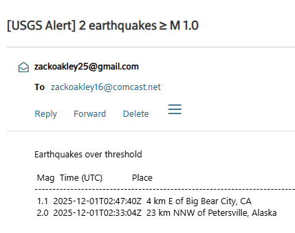

# USGS Earthquake Alert (Python + SQLite + Email Alerts)

This project is a fully automated earthquake-monitoring pipeline that fetches recent USGS earthquake data, stores new events in a local SQLite database, evaluates them against a configurable magnitude threshold, and sends an email alert when significant earthquakes occur.

The system runs hourly via Windows Task Scheduler and is designed to simulate a real-world client project with reliability, logging, and automation.

# Features
- Hourly automated ingestion of USGS “All Earthquakes, Past Hour” feed
- JSON → Python dict normalization using a custom extractor
- SQLite persistence with event-ID-based deduplication
- Magnitude threshold filtering (configurable via .env)
- Single consolidated alert email summarizing events ≥ the threshold
- SMTP integration using a secure Gmail App Password
- Windows Task Scheduler automation with a .bat runner for convenience

# Tech Stack
- Python 3.12
- SQLite (local, file-based)
- APIs: USGS Earthquake GeoJSON Feed
- Libraries:
  - requests – Fetch USGS feed
  - python-dotenv – Load configuration
  - smtplib + email – SMTP email sending
  - Standard Library: sqlite3, datetime, json, etc

# Project Structure
```
USGS-Earthquake-API-Warning/
│
├── src/
│   ├── ingest.py          # Main workflow: fetch, insert, filter, email
│   ├── utils.py           # extract_event_fields() normalization logic
│   ├── db.py              # SQLite initialization + insert w/ dedupe
│   ├── alert.py           # Threshold filtering logic
│   ├── email_utils.py     # Email construction + SMTP send
│   └── config.py          # Loads .env variables
│
├── data/
│   └── earthquakes.db     # SQLite database (git-ignored)
│
├── tests/                 # Various unit tests
|   |__ alert_test.py
|   |__ api_test.py
|   |__ extract_event_fields_test.py                
│
├── run_ingest.bat         # Runs the ingest workflow (used by Task Scheduler)
│
├── .env                   # Environment configuration (not committed)
├── .gitignore
├── requirements.txt
└── README.md
```


# Setup Instructions:
1) Clone the repository:
git clone https://github.com/yourusername/USGS-Earthquake-API-Warning.git
cd USGS-Earthquake-API-Warning

2) Install dependencies:
pip install -r requirements.txt

3) Create a .env file
EQ_MAGNITUDE_THRESHOLD=6
EMAIL_USER=youraddress@gmail.com
EMAIL_PASS=your_app_password_here
EMAIL_TO=youraddress@gmail.com
SMTP_SERVER=smtp.gmail.com
SMTP_PORT=587

**Gmail Note
You must enable 2-Step Verification and create a Gmail App Password for SMTP.
(App Passwords ≠ your Gmail password.)

4) Run manually (for testing)
python -m src.ingest
If any earthquakes exceed the threshold, you will receive an email alert.

5) Hourly Automation (Windows Task Scheduler)
Create run_ingest.bat (already included):
@echo off
cd C:\Users\zacko\Portfolio\USGS-Earthquake-API-Warning
python -m src.ingest

update cd C:\Users\zacko\Portfolio\USGS-Earthquake-API-Warning to your cloned location

Open Task Scheduler → Create Task
Trigger: Repeat task every 1 hour indefinitely
Action: Start Program → select run_ingest.bat
Run whether user is logged on or not
Run with highest privileges
Your system now monitors earthquakes automatically every hour.

# Example of alert email: 


